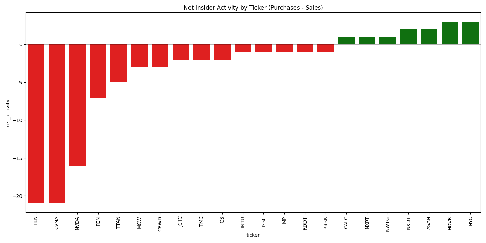
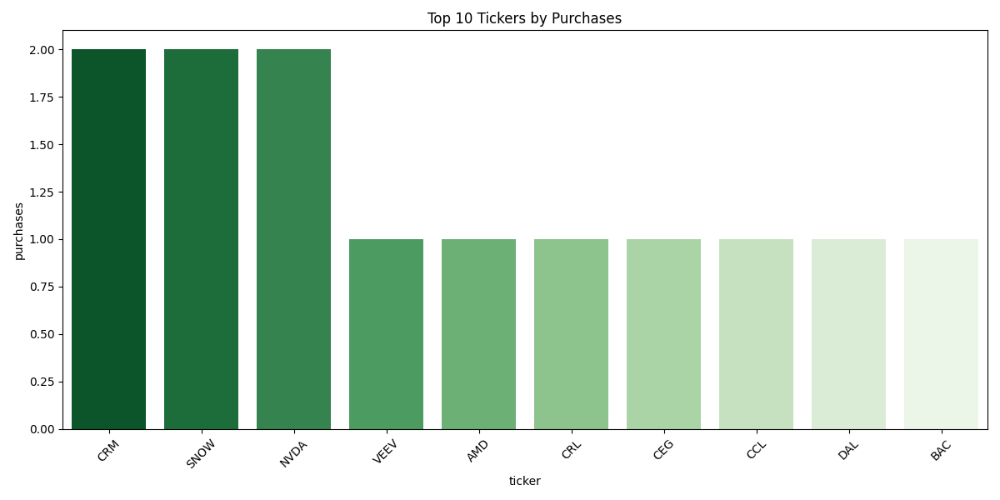

# stonks
Simple CLI Tools to obtain, analyze, visualize, or track data related to stocks.

### Description
Currently, we simply generate visualizations for insider and congressional stock trades, 
scraped from an excellent website that makes this data available. 

### Usage
```
./run.sh 
```
### Output
.png visualizations created from .csv data that was scraped 
```
congress_trading_data.csv
congress_trading_distribution.png
congress_trading_net_activity.png
congress_trading_top_purchases.png
congress_trading_top_sales.png
insider_trading_data.csv
insider_trading_distribution.png
insider_trading_net_activity.png
insider_trading_top_purchases.png
insider_trading_top_sales.png
```
These files are placed in a directory that is created automatically in qq/scripts/date_time

Two examples of .pngs are below. 

### Insider net activity for June 29, 2025  


### Congress top purchases for June 29, 2025  

